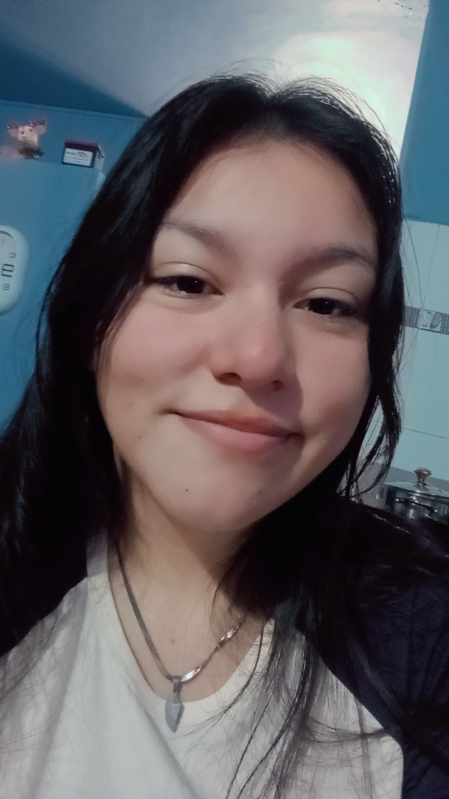

# Reflexión individual
## Intereses y experiencias previas relacionadas con videojuegos o desarrollo
Mi relación con los videojuegos tiene dos lados: jugarlos y querer crearlos. Aunque mi experiencia en desarrollo aún es básica, tengo una gran motivación por aprender cómo se hacen, explorar el proceso creativo y convertir mis ideas en proyectos reales.

Como jugadora, disfruto de juegos de aventura, mundos abiertos, simuladores, títulos relajantes y juegos de ritmo. Me gusta probar experiencias variadas que me sorprendan, me hagan pensar o simplemente me permitan disfrutar y desconectarme.

--- 

## ¿Qué significa para ti “diseñar un videojuego” en este momento?
Para mí, diseñar un videojuego es definir su esencia: qué quiere transmitir, cómo debe sentirse y qué experiencia ofrecerá al jugador. Implica tomar decisiones sobre mecánicas, narrativa, progresión y jugabilidad, buscando siempre que todo tenga coherencia.

No lo veo como hacer todo lo técnico, sino como tener una visión clara y guiar el proyecto para crear ese tipo de experiencia que se esté buscando.

--- 

## Cómo te imaginas tu rol como diseñador durante el curso
Me imagino con un rol flexible y colaborativo, participando en distintas etapas del diseño: desde la creación de ideas hasta el prototipado y la mejora de mecánicas. Me gustaría aportar ideas, recibir retroalimentación, trabajar en equipo y aprender tanto de mis compañeros como del proceso.

---

## Foto para uso académico interno

