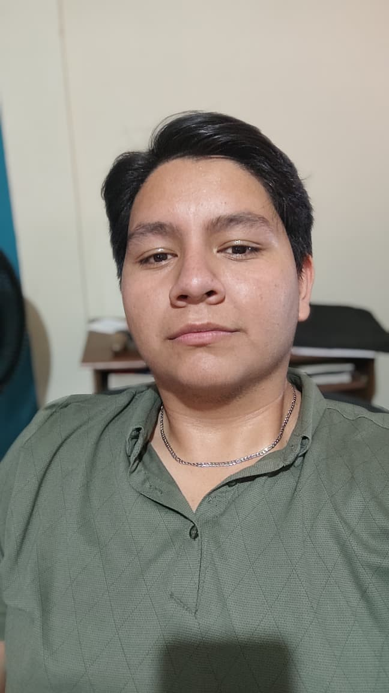

# Presentación personal – Diseño de Videojuegos

## Intereses y experiencias previas relacionadas con videojuegos o desarrollo

Lo que me encanta de videojuegos que he jugado es la conexión real que siento al jugarlos, a veces me suelo imaginar cómo sería estar dentro de ese universo y vivirlo en carne propia. 

Yo creo que ese pensar es el que despliega las ideas de un diseñador, ideas que junto a mi experiencia en desarrollo me servirá muchisimo para analizar la interacción entre el jugador y el sistema que tengamos pensado crear.

---

## ¿Qué significa para mí "diseñar un videojuego" en este momento?

Diseñar para mí es moldear toda la esencia de un juego, tomar decisiones sobre las reglas, comportamientos, mecánicas para construir un espacio de posibilidades inmenso con la intención de crear emociones en quien juega.

Que las acciones del jugador tengan resultados claros y que afecten el contexto del juego.

---

## ¿Cómo me imagino mi rol como diseñador durante el curso?

Me veo como alguien que debe practicar la habilidad más importante del diseño, que es escuchar. Escuchar al juego, a mi equipo, al jugador y mí mismo, con el objetivo de desarrollar una sensibilidad para ver los propios diseños a través de distintos lentes o perpectivas, haciend que cada elemento trabaje en armonia.

---

## Fotografía

