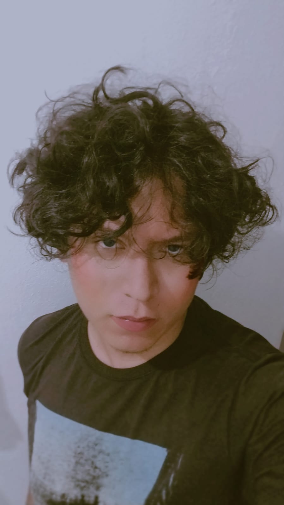

# Presentación personal – Diseño de Videojuegos

## Intereses y experiencias previas relacionadas con videojuegos o desarrollo

Desde hace tiempo tengo un interés constante por los videojuegos, no solo como forma de entretenimiento, sino como sistemas interactivos capaces de generar experiencias, emociones y narrativas significativas. He dedicado parte de mi tiempo a analizar cómo funcionan los juegos que consumo, prestando atención a sus mecánicas, ritmo, dificultad y decisiones de diseño.

Además, cuento con experiencia previa en áreas relacionadas con el desarrollo de software y la lógica de programación, lo que me ha permitido comprender los videojuegos como sistemas estructurados y no únicamente como productos creativos. Esta combinación entre interés creativo y pensamiento técnico ha sido clave para acercarme al diseño de videojuegos.

---

## ¿Qué significa para mí "diseñar un videojuego" en este momento?

En este punto, diseñar un videojuego significa tomar decisiones conscientes sobre la experiencia que tendrá el jugador. No se trata únicamente de crear reglas o historias, sino de definir cómo interactúan los sistemas del juego y qué sensaciones generan.

Diseñar implica pensar en el jugador, anticipar sus acciones, errores y aprendizajes, y construir un espacio de posibilidades donde cada decisión tenga sentido. También significa aceptar que el diseño es un proceso iterativo, sujeto a cambios y mejoras constantes a partir de la prueba y el análisis.

---

## ¿Cómo me imagino mi rol como diseñador durante el curso?

Durante el curso me imagino como un diseñador en proceso de formación, abierto a experimentar, equivocarse y aprender. Mi rol será el de analizar críticamente los juegos, justificar decisiones de diseño y colaborar con otros, entendiendo que el diseño de videojuegos es un trabajo tanto individual como colectivo.

Espero desarrollar una mayor sensibilidad hacia la experiencia del jugador, así como fortalecer mi capacidad para transformar ideas abstractas en sistemas jugables concretos.

---

## Fotografía

Dejo una fotografia de mi rostro:

